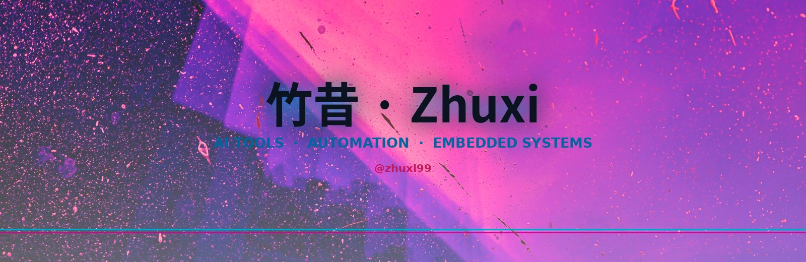

  <picture>
    <source media="(prefers-color-scheme: dark)" srcset="assets/hero.jpg" />
    
  </picture>

  
  
  
  

## 概览 · Overview

构建实用的 AI 工具与开发者自动化，同时探索机器人、嵌入式系统和 C 开发。欢迎一起做 AI 工具、开源开发者工具，以及能和真实硬件对话的软件。

Building practical AI tools and developer automation, with side quests into robotics, embedded systems, and C. Open to collaboration on AI utilities, open-source dev tools, and software that talks to real hardware.

  
  

  

## 代表项目 · Featured

<table align="center">
  <tr>
    <td align="center" width="50%">
      <b><a href="https://github.com/zhuxi99/ai-price-compare.github.io">AI Price Compare</a></b> 
      比较 AI 模型和 API 供应商在输入、缓存输入、输出 token 上的价格。 
      <a href="https://zhuxi99.github.io/ai-price-compare.github.io/">Live demo</a> · <a href="https://github.com/zhuxi99/ai-price-compare.github.io">Source</a> 
      
      
      
    </td>
    <td align="center" width="50%">
      <b><a href="https://github.com/zhuxi99/STM32F103C8-6-">STM32 Six-Servo Robotic Arm</a></b> 
      STM32F103C8T6 六自由度机械臂控制器，支持蓝牙控制与嵌入式 C 开发。 
      <a href="https://github.com/zhuxi99/STM32F103C8-6-">Source</a> 
      
      
      
    </td>
  </tr>
</table>

## 工具箱 · Toolbox

  

## 其他仓库 · More

  <a href="https://github.com/zhuxi99/emailctl">emailctl</a> ·
  <a href="https://github.com/zhuxi99/libcimbar">libcimbar</a> ·
  <a href="https://github.com/zhuxi99/cloud-mail">cloud-mail</a> ·
  <a href="https://github.com/zhuxi99/newapi-checkin">newapi-checkin</a> ·
  <a href="https://github.com/zhuxi99/codex-autoresearch">codex-autoresearch</a>

## 联系 · Contact

  <a href="https://github.com/zhuxi99">GitHub</a> ·
  <a href="mailto:xzhu97008@gmail.com">Email</a> ·
  <a href="https://zhuxi99.github.io/ai-price-compare.github.io/">Live demo</a>

Profile header background from Unsplash. Stats, streak, and contribution graph are rendered by third-party GitHub badge services.
